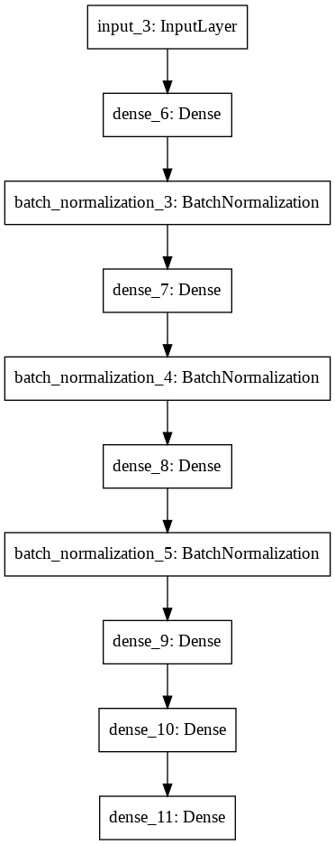

# About the Project

Aim of the project is to count number of people and their genders from a given Audio as mp3/wav file

## About the dataset

_CountNet_ is a deep learning model to estimate the number of concurrent speakers from single channel mixtures is a very challenging task that is a mandatory first step to address any realistic “cocktail-party” scenario. It has various audio-based applications such as blind source separation, speaker diarisation, and audio surveillance.

[For more information about dataset, visit ](https://github.com/faroit/CountNet/blob/master/README.md)

## Problem Thinking 
**I followed two types of approahes to solve this problem:**

* First to extract mel-frequency cepstrum coefficients(Mfccs) features using librosa library and then passing them
    to the fully connected layers for prediction
* Second to convert audio into its spectrogram and then passing it to the CNN layers followed by  fully    connected layers  to do the prediction  

                 

## Procedure
* First prepare the training data from the dataset by converting **.wav** file into mfccs features and **spectrograms** for the second model using librosa linrary
* Do the necessary preprocessing for both the models like resizing of images and reshaping into mfccs 
* Also add your own traning data by uploading audio files and preprocess and add the relevant labels
* Split data into training and testing dataset to check performace of model on unseen data
* Now choose the model architecures, loss function and the optimizer
* Choose the appropriate number of epochs, relevant callbacks such as early stopping 
* Evaluate the data on test data and on your  own audio by uploading it extract features and spectrogram and calling model.predict

## Model Architectures
                 

## Test accuracy 
**Best test accuracy  was achienved by the second model using spectrograms of audio**
* Counting Male accuracy : **87%**
* Counting Female accuracy : **85%**
* Average accuracy : **86%**
  

